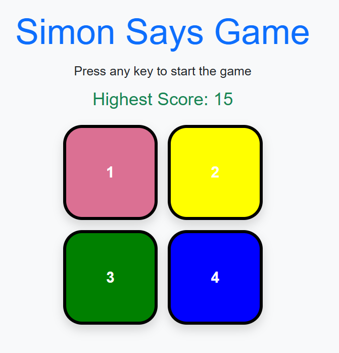

# Simon Says Game 🎮

A simple and fun memory game built using HTML, CSS, JavaScript, and Bootstrap.

## 🚀 How to Play
1. Press any key to start the game.
2. Watch the color pattern.
3. Repeat the pattern by clicking the buttons in the same order.
4. The sequence gets longer every round. Don’t mess up!

## 🧠 Features
- Color and animation effects
- High score saved in browser (`localStorage`)
- Responsive layout using Bootstrap
- Clean and simple UI

## 🛠 Technologies Used
- HTML
- CSS
- JavaScript
- Bootstrap 5

## 📸 Preview

## 🔗 Live Demo
[Play Now (GitHub Pages)](https://your-username.github.io/simon-says-game/)

## 📄 License
This project is licensed under the MIT License.
